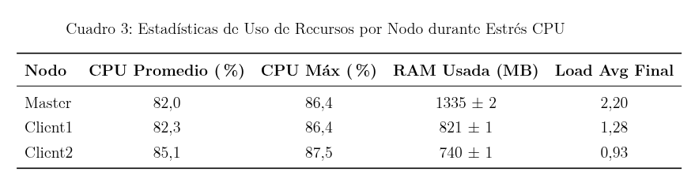
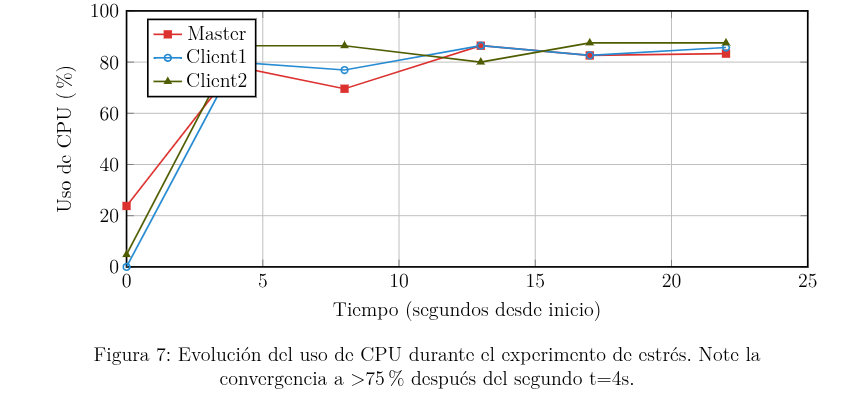
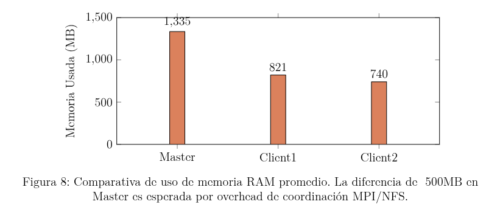

# Laboratorio 3 - Cluster en MPI

Este laboratorio tiene como objetivo ejecutar un programa de estrés en un clúster MPI y monitorear su desempeño.

---

## Pasos de ejecución para  Iniciar el monitoreo
Ejecuta el script de monitoreo en segundo plano y guarda el reporte en un archivo de log:

```bash
# Iniciar monitoreo
./monitorear.sh 2 > monitoreo_estres.log &
MONITOR_PID=$!

# Ejecutar el programa de estrés
mpirun --tmpdir /home/master/Compartidos/tmp_mpi -np 6 -hostfile hosts.txt ./prueba_estres 60

# Detener el monitoreo
kill $MONITOR_PID
```

## Resultados 
Se logró una utilización sostenida de CPU >75% en los 6 núcleos del cluster durante 25 segundos continuos, validando la correcta configuración de OpenMPI 4.1.6 y la topología de red.








